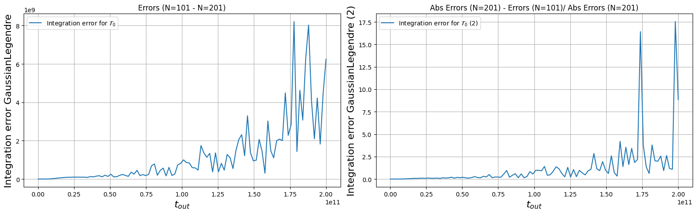
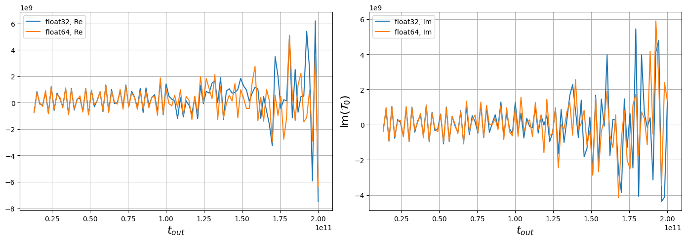
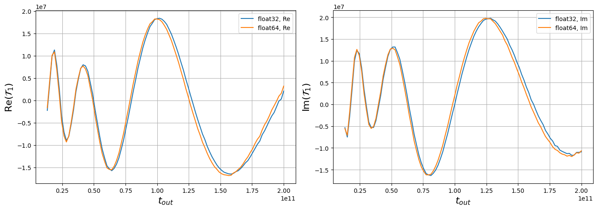
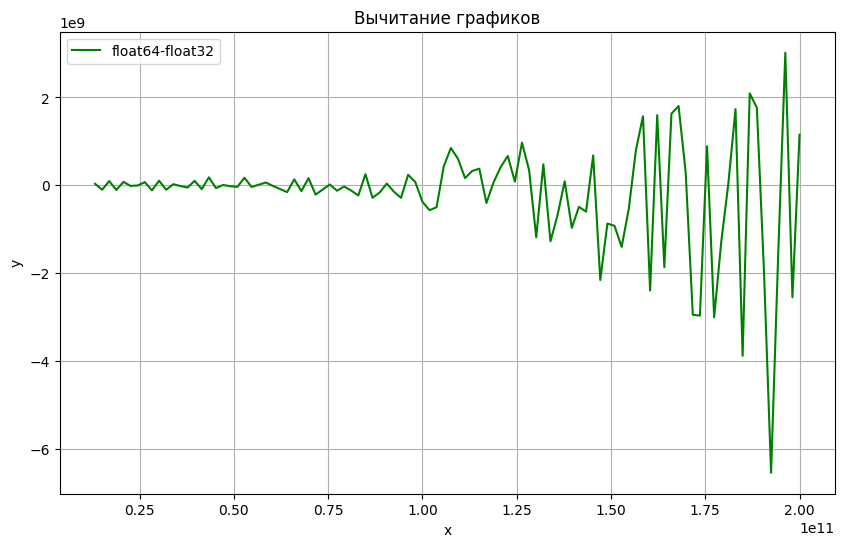
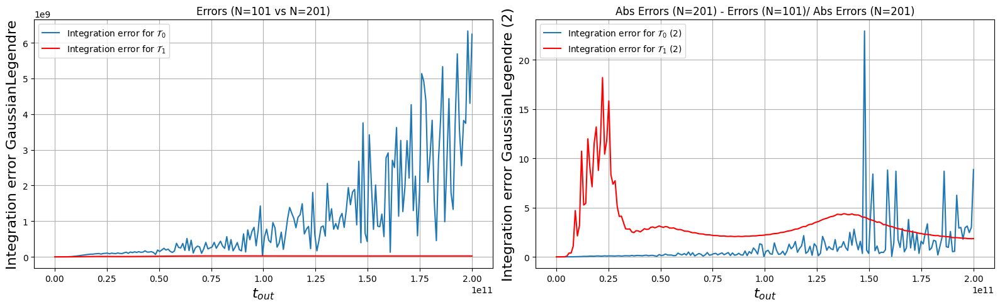
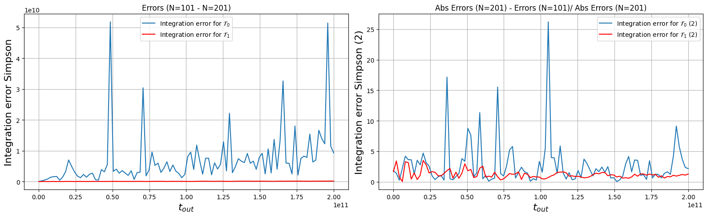
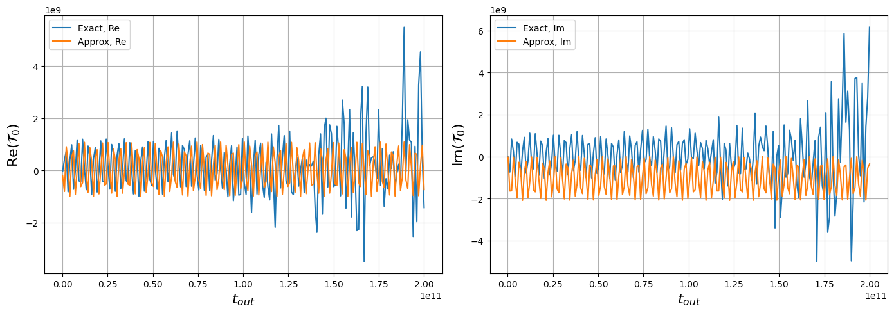
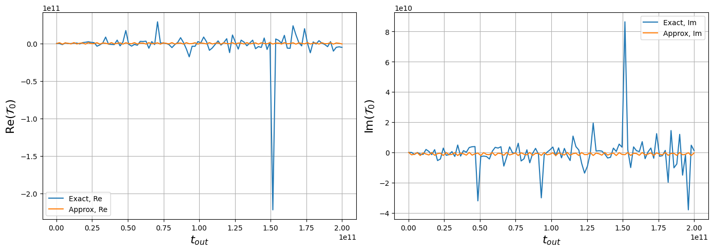
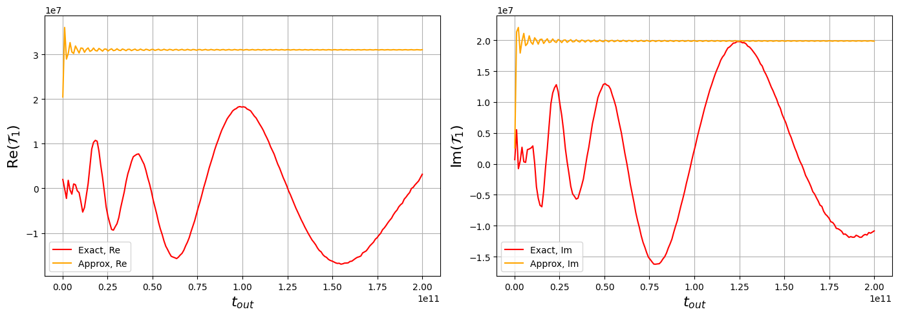
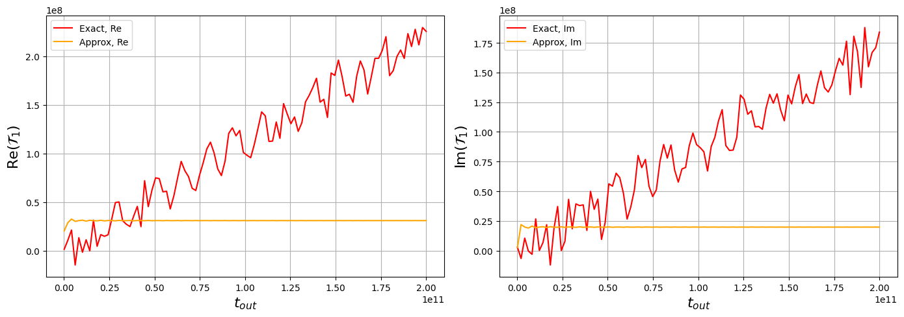

# Problem of numerical integration

<ins>Попытка понять странное поведение численного интегрирования на больших временах.</ins> 

Насчет погрешности численного интегрирования : однозначного ответа я не нашла 

Видно, что **погрешность растет с ростом t_out**: - *num_check.ipynb*

- Первое предположение, что дело в floating point.

Хотелось бы увидеть в подтверждение, что беря float32, 'странное поведение' начиналось бы раньше из-за переполнения (float128 нет). Но мы видим, что, действительно, поведение чуть разнится при float32 и float64. И дальше со временем все больше. 
Но не наблюдается, что 'странное поведение' появляется раньше (по числам внимательнее проверила). - (data in txt 32_vs_64, code in torch_7 (cell 16))
И вот такая осциляционная разница графиков, которую мы видим, нам ничего не говорит: ни подтверждает, ни опровергает теорию: - *diff_graph.ipynb* 

- Второе предположение, что насколько меняется погрешность зависит от численного метода интегрирования. 
Но посмотрев, ничего хорошего не увидела: - *num_check.ipynb*

                    
                    
                    

- Попробовать проследить влияние пар-ров матода интегрирования на погрешность