# Problem of numerical integration

<ins>Попытка понять странное поведение численного интегрирования на больших временах.</ins> 

Насчет погрешности численного интегрирования : однозначного ответа я не нашла 

Видно, что **погрешность растет с ростом t_out**: - *num_check.ipynb*
Рассмотрим разные N: чем больше N, тем позже ошибка начинает накапливаться и сильно меняться 

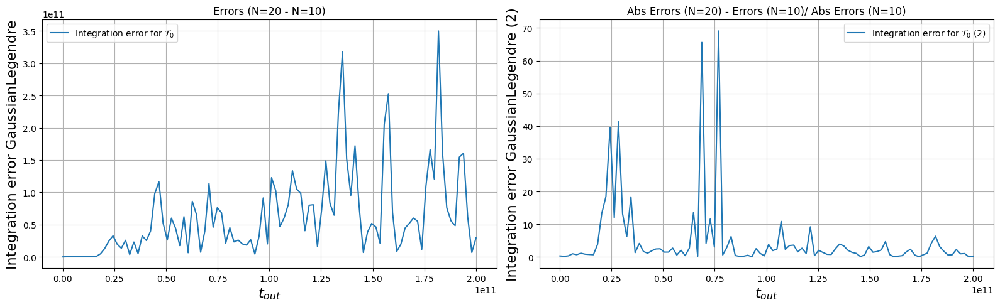
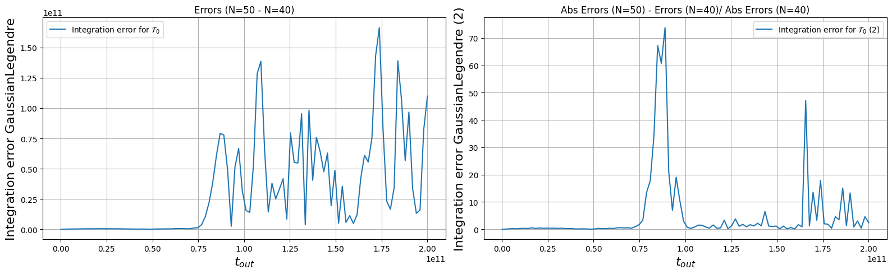
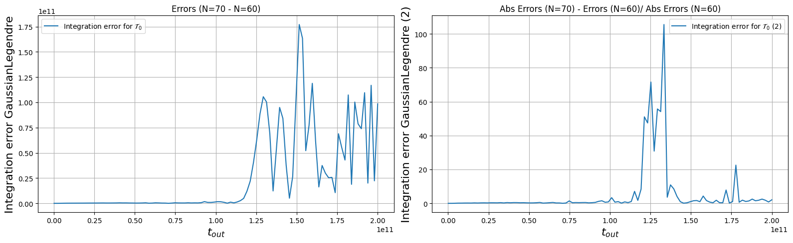
         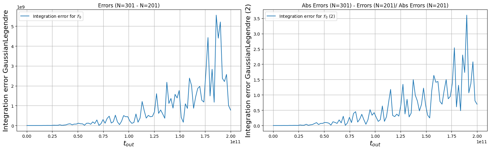
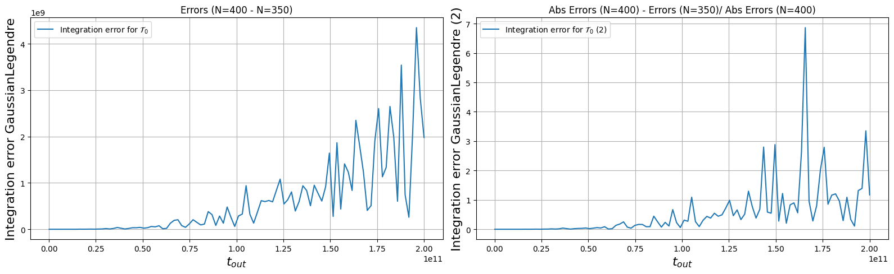

- Первое предположение, что дело в floating point.

Хотелось бы увидеть в подтверждение, что беря float32, 'странное поведение' начиналось бы раньше из-за переполнения (float128 нет). Но мы видим, что, действительно, поведение чуть разнится при float32 и float64. И дальше со временем все больше. 
Но не наблюдается, что 'странное поведение' появляется раньше (по числам внимательнее проверила). - (data in txt 32_vs_64, code in torch_7 (cell 16))
И вот такая осциляционная разница графиков, которую мы видим, нам ничего не говорит: ни подтверждает, ни опровергает теорию: - *diff_graph.ipynb* 

- Второе предположение, что насколько меняется погрешность зависит от численного метода интегрирования. 
Но посмотрев, ничего хорошего не увидела: - *num_check.ipynb*

                    
                    
                    

- Рассмотрим поможет ли N получить "хороший" вид численного интегрирования (схожий с приближением) на более больших интервалах [t_in, t_out] 

# N = 101 vs N = 600 vs N = 700: 

**численное решение стало ближе к приближенному и в чуть большем диапазоне**

tspec = np.linspace (1.32e8, 2.6e10, 100)
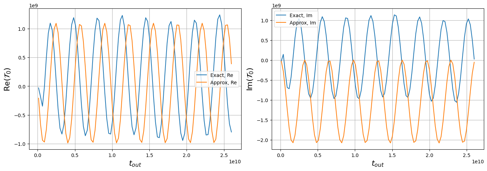

tspec = np.linspace (1.32e8, 2e11, 100)
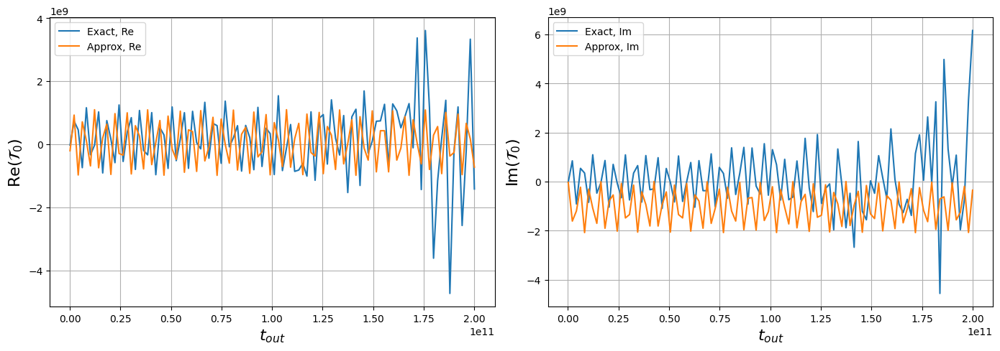             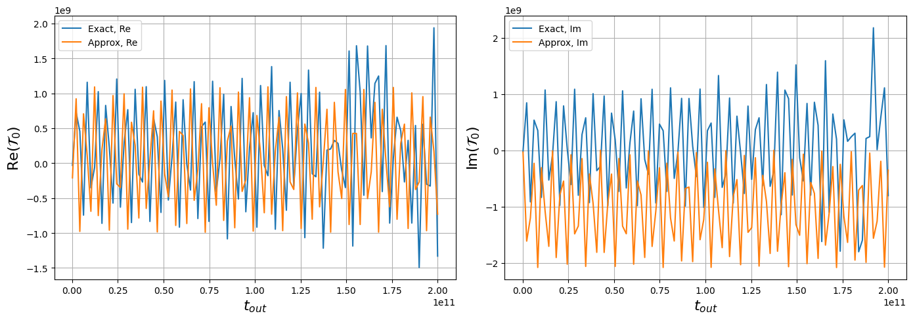     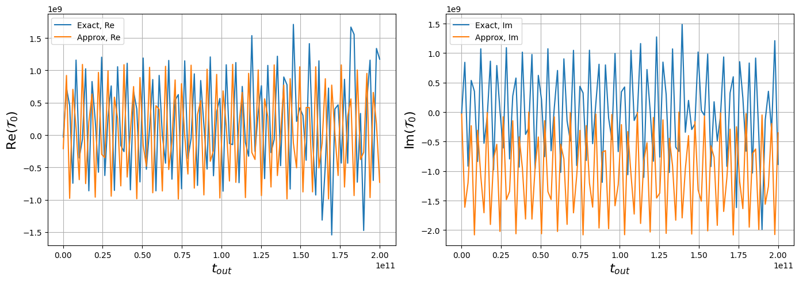
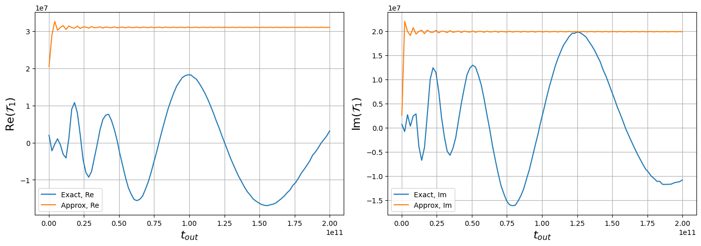             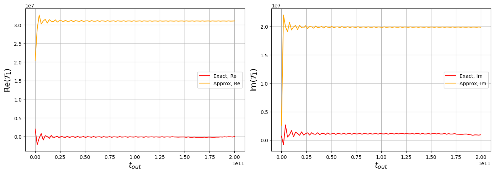

# N = 101 vs N = 1000   : 
tspec = np.linspace (1.32e8, 1e12, 100)
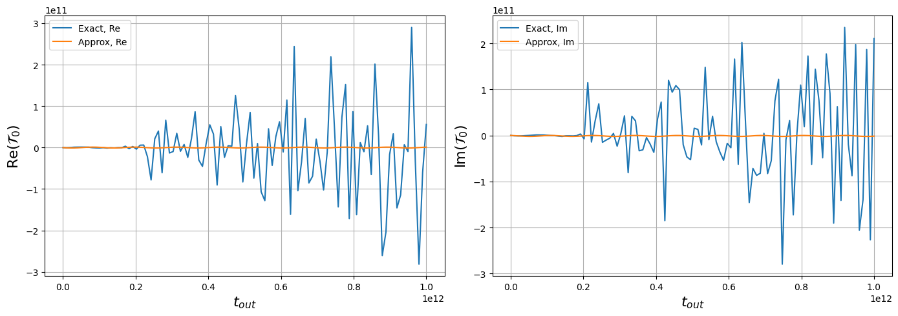           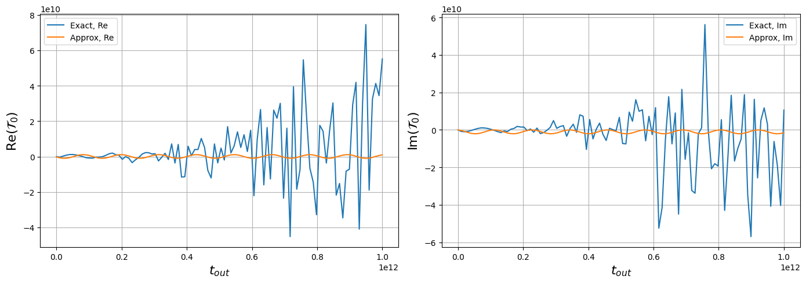
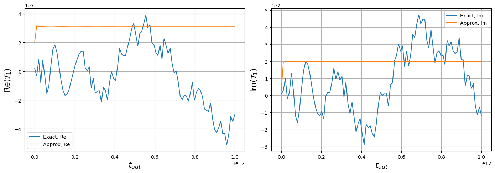           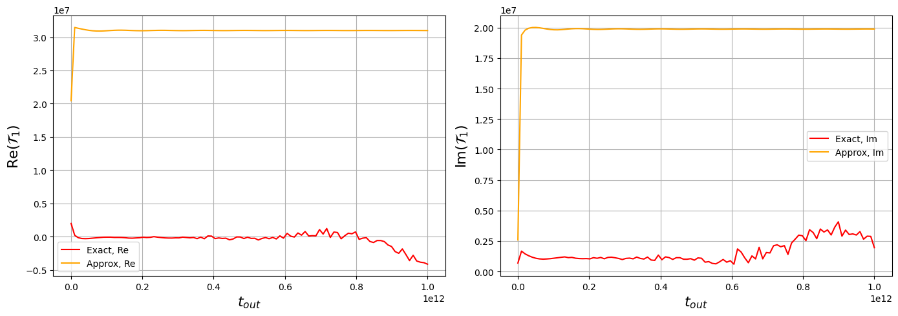
